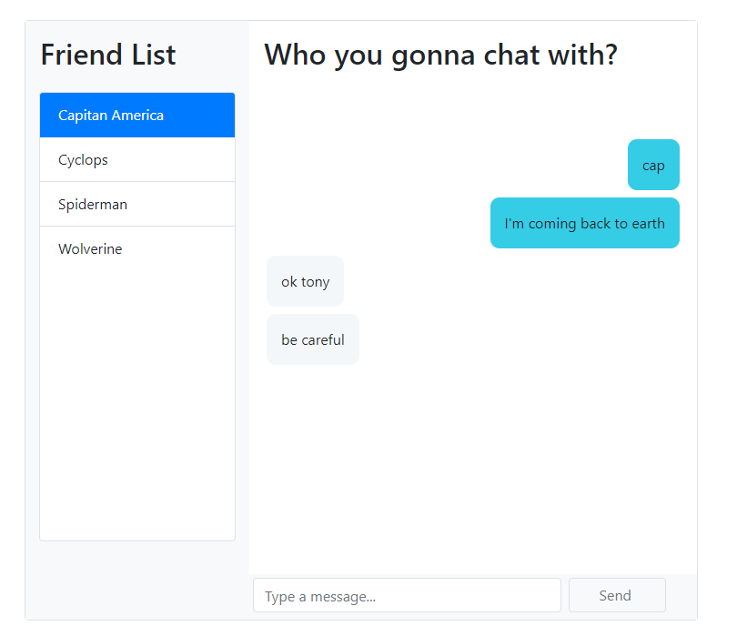

# React Chat Widget App With CometChat Pro

This example shows how to build a React chat application using CometChat Pro SDK and React Hooks. 

SCREENSHOTS

Jump straight into the code or read the accompanying step-by-step guide here on our blog.

## Technology
This demo uses:

* [CometChat Pro JavaScript SDK](https://github.com/cometchat-pro/javascript-chat-sdk)
* React

## Running the demo locally
* Download the repository
* run `npm install`
* You need to sign up for CometChat PRO and create your application first
* Create an ApiKey. You can use auth-only permission for this application
* Put your AppID and ApiKey into `src/config.js` file
* run `npm start`
* A browser will open `localhost:3000`
